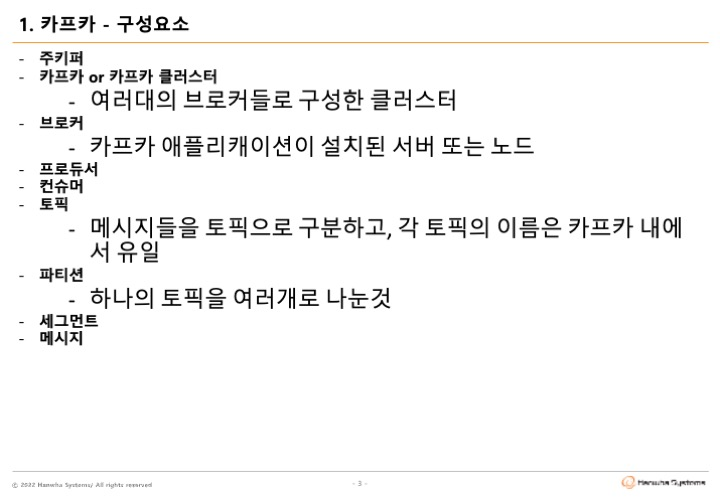
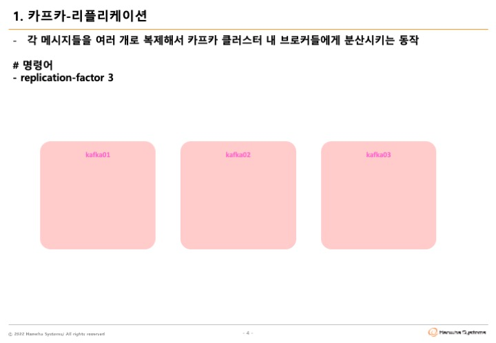
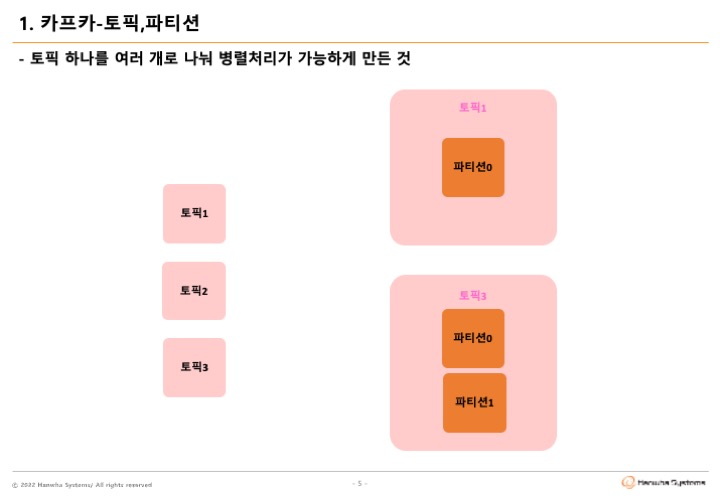
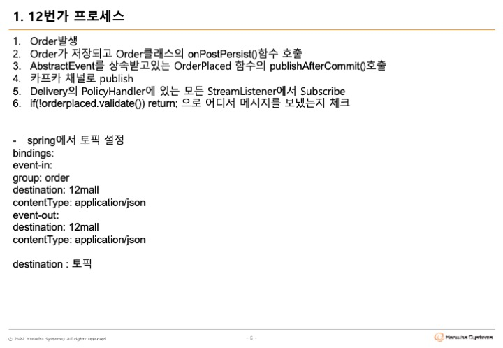
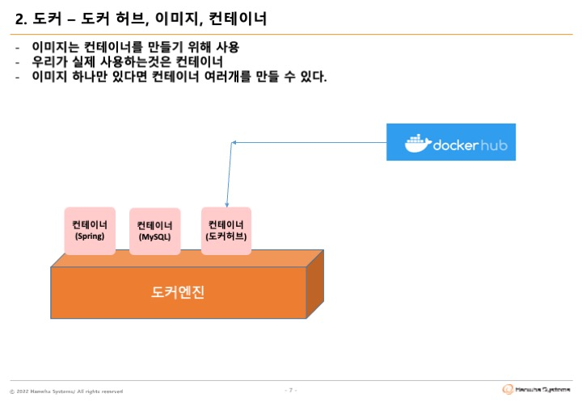
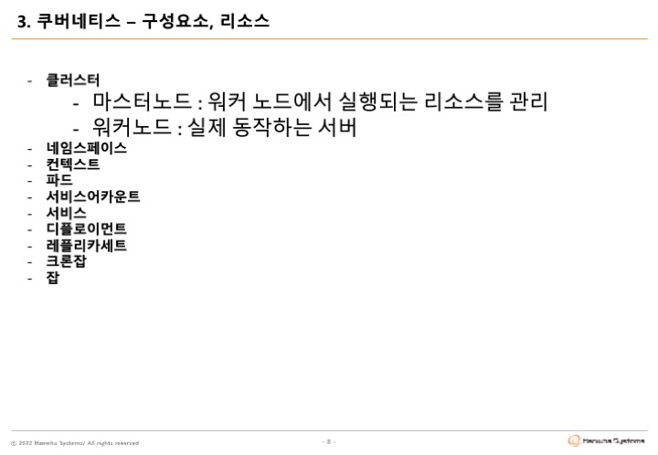
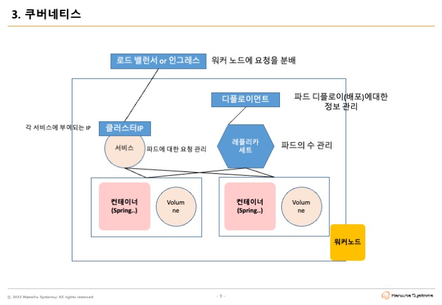

# 숙소예약 서비스 (BearBnB not AirBnB)

## DAY 1

1. 분석설계
- 4개 Boundary Context
- Room, Reservation, Payment, Message, (+ViewPage)

2. SAGA Pattern (Pub / Sub)
- Kafka 구현
- https://sarc.io/index.php/development/2128-saga-pattern
Saga Pattern은 마이크로 서비스에서 데이터 일관성을 관리하는 방법입니다.
각 서비스는 로컬 트랜잭션을 가지고 있으며, 해당 서비스 데이터를 업데이트하며 메시지 또는 이벤트를 발행해서, 다음 단계 트랜잭션을 호출하게 됩니다.
만약, 해당 프로세스가 실패하게 되면 데이터 정합성을 맞추기 위해 이전 트랜잭션에 대해 보상 트랜잭션을 실행합니다.
NoSQL 같이 분산 트랜잭션 처리를 지원하지 않거나, 각기 다른 서비스에서 다른 DB 밴더사를 이용할 경우에도 Saga Pattenrn을 이용해서 데이터 일관성을 보장 받을 수 있습니다.

3. CQRS Pattern (Command Query Responsibility Segregation)
- ViewPage 구현
- 명령 / 조회 책임 분리
- Define a view database, which is a read-only by subscribing

4. Correlation / Compensation(Unique Key)
- 유니크키, FooCancelled 구현
- 데이터 일관성 처리를 위해 전달하는 key = Correlation-key
- 트랜젝션 실패 시 데이터의 일관성 유지를 위해 Rollback 처리 가능 = Compensation
- 데이터 일관성과 무결성 유지 !
- 상관관계 / 보상

5. Request / Response (Feign Client / Sync.Async)
- @FeignClient(name ="Foofeign", url="api.github.com/foo", configuration = "Config.class")
- REST 호출을 도와주는 Http Client Binder가 Feign Client 
- JPA는 인터페이스만으로 그 과정을 모두 축소
- Feign을 적용하면 번거로운 RestTemplate과 같은 호출 방식을 인터페이스 하나만으로 축소

6. Gateway
- KeyCloak, Spring Gateway 구현
- 라우팅

7. Deploy / Pipeline 
- AWS CodeDeploy, Jenkins 구현
- CI/CD

8. Circuit Breaker
- istio 구현
- 요청이 과도할 경우 CB 를 통하여 장애격리, 장애전파차단

9. Autoscale(HPA)
- K8S, HorizontalPodAutoscaler kind

10. Self-Healing(Liveness Probe)
- K8S, livenessProbe (deployment.yml)

11. Zero-Downtime Deploy(Readiness Probe)
- K8S, ReadinessProbe (deployment.yml)

12. Config Map / Persistence Volume
- K8S, ConfigMap kind (cofingmap.yml)

13. Polyglot (X)
- MongoDB/MariaDB/MYSQL, java(spring)/python(flask,fastAPI)
- Polyglot Persistence/Programming
- 각 마이크로 서비스들의 구현 목표와 기능 특성에 따른 각자의 기술 Stack 과 저장소 구조를 다양하게 채택하여 설계

-----
-----

## 📢 About

- 지원
  - 디지털워크그룹 / 김은종 대리
  - Digital Native TF / 조성국 대리
- Platform

  - ZOOM

    - URL : 
    - 회의 ID : xxx xxx xxxx
    - 암호 : xxxx

## 🕙 Schedule

- 일자별 진행

  |   일자    | 진행           | 내용                                |
  | :-------: | :------------- | :---------------------------------- |
  | 09/21 AM  | OJT            | 과정설명 과제수행환경설명        |
  | 09/21 PM  | Brain Storming | msaez.io                            |
  | 09/22 ALL | Team Project   | 팀별과제 수행                       |
  | 09/23 AM  | Team Project   | 팀별과제 수행                       |
  | 09/23 PM  | Wrap Up        | 과제 제출 시작:14시 마감:16시 |

- 시간별 진행

  - 09:00 ~ 11:30 오전과정
  - 11:30 ~ 13:00 점심시간
  - 13:00 ~ 17:30 오후과정

    > NOTE

    - 팀별과제 수행중에는 오전/오후과정 중 자율적으로 휴식
    - 3일차 과제제출시에는 준비된 팀부터 팀별 소그룹에서 발표 진행(마감시간 준수)
    - 과제 제출 : 발표 진행 후, ZOOM 채팅방에 github 주소 공유

## 👫 Team

| 팀  |   성명   | 직급 | 소속             |
| :-: | :------: | :--: | :--------------- |
|  1  | 🎖 안소영 | 과장 | 방산운영1팀      |
|     |  김지훈  | 사원 | SharedService1팀   |
|     |  박진곤  | 대리 | 디지털에셋그룹   |
|  2  | 🎖 최원식 | 과장 | 서비스운영2팀  |
|     |  김영준  | 대리 | Platform개발팀   |
|     |  이재영 | 대리 | 디지털워크그룹  |
|     |  황상식 | 과장 | 디지털워크그룹  |

## 🤷🏻‍♂️🤷🏻‍♀️ Curriculum

## ✏️ Evaluation

- 분석설계
- SAGA Pattern (Pub / Sub)
- CQRS Pattern
- Correlation / Compensation(Unique Key)
- Request / Response (Feign Client / Sync.Async)
- Gateway
- Deploy / Pipeline
- Circuit Breaker
- Autoscale(HPA)
- Self-Healing(Liveness Probe)
- Zero-Downtime Deploy(Readiness Probe)
- Config Map / Persistence Volume
- Polyglot

  > NOTE

  - 구현방법 및 산출물 양식은 제한 없이 자유롭게 진행
  - 문항별 담당자명 표시

## 📑 To-Do

- <a href="https://www.msaez.io/#/" target="_blank">Brain Storming</a>

  - 팀별로 주제 선정 및 이벤트 스토밍 진행

- GitHub : [https://github.com/seonguk9303/hw5_capstone_proj]
- GitPod
  - Github 계정 및 Repositoy(public) 준비 ( **for FORK** )
  - gitpod.io/#/{Github-Repository-URL} or Browser Extension 설치(https://www.gitpod.io/docs/browser-extension)
  - Collaboration & Sharing
    - 팀장 : github.com > repository > Settings > Collaborators > Add People ; 팀원초대
    - 팀장 / 팀원 : gitpod.io > Settings > Integrations > GitHub > Edit Permissions > Public_repo Check ; GitPod - GitHub 권한설정
  * gitpod 초기 연동시 필요한 라이브러리들이 없는 상태이며 **.gitpod.yml** 파일에 선언한 명령어들 자동 실행됨
  * 실행 안되는 명령어들이 있으면 직접 설치
- AWS (_약 15~20분 소요_)
  - AWS IAM 계정(MSA5차수).xlsx 참고
  - Region-Code : 메일 내 Region
  - Cluster-Name : Account-Id
  - Image-Repository-Name : Account-Id

> 참고

이전실습환경(https://labs.msaez.io/)에 접속해서 실습내용을 확인해 볼 수 있으나, `INTO THE LAB`에서 실습했었던 온라인상의 실행은 불가하므로, `파일다운로드`버튼을 이용해 실습했던 code를 다운로드 해서 확인

## 🧨 Attention

### GitPod

- `Github 계정 1개` 기준으로 `약 50개`까지의 Pod를 각각 `약 24시간`까지 유지하므로 진행시 유의
- 장기간 자리비움시(점심시간) 작업중인 내용이 유실될 있으니 `저장` 또는 `commit(push)`

## 👍 Good Practice & Reporting Format

- 배달의 민족 Cover : [https://github.com/msa-ez/example-food-delivery]
- Air BnB Cover : [https://intro-kor.msaez.io/example-scenario/accommodation-reservation/]

## 🪶 Lite Version (for FORK )

- Dragon Water Lite 🦖💧 : [https://github.com/yongdoohar/msa-capstone-project]

## Thanks

- Cloud Native개발팀 / 양기훈 과장, 변용수 대리
- 네트워크운영팀 / 윤정호 대리
- Digital Native TF / 정현영 사원

## 주요개념

</img>
</img>
</img>
</img>
</img>
</img>
</img>
